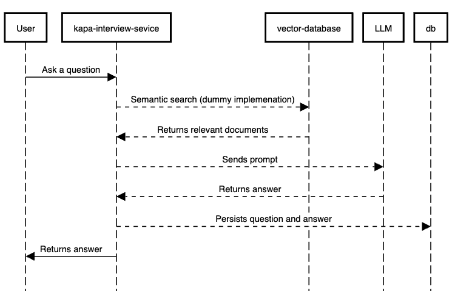

# kapa-interview-service

This repository contains a monolithic RAG application. This service is not real but it was written with the real `kapa.ai` system in mind. It is identical in its technologies used but it is much smaller in scale and all its core implementations have been replaced by dummy code to reduce external dependencies.

You can see some deployed examples of the real kapa [here](https://docs.kapa.ai/examples).
 
## Introduction

### What does `kapa-interview-service` do?

With `kapa-interview-service` you can deliver the kapa.ai chat bot functionality to multiple companies at the same time. A company or a customer is represented by a `Team`. Each `Team` can have multiple `Users` that can send API requests to access the functionality of the service. Each `Team` can have multiple `Projects`. A `Project` represents one instance of a kapa.ai chatbot. This means one company can have multiple chatbot instances.

Users can send API requests to `kapa-interview-service` and receive a generated answer. Users can also ask follow up questions and continue a conversation. The service will keep track of all past conversations and users can get a list of them via API call. These are the only two API endpoints currently implemented by the service.

`kapa-interview-service` also gives you the option to configure an email report to be sent to all `Teams` with usage statistics. For this you can configure an asynchronous task that runs as often as you want.

### How does `kapa-interview-service` implement RAG?

RAG stands for **Retrieval Augmented Generation** which is the fundamental concept kapa.ai is built on. When a new question comes in `kapa-interview-service` performs the following actions which are implemented by the `RAGAgent` class.
1.  It takes the question and performs semantic search over a vector database. This means it tries to find the most relevant documents to answer the question which have been indexed beforehand. `kapa-interview-service` only has a dummy implementation for this which you can find in the `Retriever` class. There is no actual vector database and the whole system needed to do the actual indexing of content is omitted here.
2. The `RAGAgent` creates a single prompt which contains the question, the relevant documents and instructions for the LLM. In a sense the `RAGAgent` asks the LLM to answer the question based on the relevant documents. 
3. The prompt is sent to an LLM to generate the answer using the `LLMClient` class. This class also just has a dummy implementation. There are no actual calls to a model here.
4. The answer is saved in the database as `QuestionAnswer` as part of a `Thread`. A `Thread` represents a conversation.
5. Now the answer is returned to the `User` that made the API call.



### What technologies does `kapa-interview-service` use?

We leverage the following tech stack
*  **Django**: The web framework `kapa-interview-service` is written in.
*  **Django Rest Framework**: the toolkit we use for writing our APIs. You can use Django without DRF but it is a lot better with it.
*  **Celery**: We use celery to run asynchronous operations. It lets you dispatch jobs directly or you can schedule them to run in regular intervals with **Celery-beat**.
*  **RabbitMQ**: Used as broker for Celery.
*  **Postgres**: Used for the relational database of `kapa-interview-service`
*  **Docker**: Docker is used to run everything locally.

## Local Development

### Requirements

You only need `Docker` installed on your computer.

### Getting started

1. Use the `docker-compose.yaml` to start all services locally. Most of us use the VSCode Docker plugin for this but you can obviously build the images and start the containers any way you like. in VSCode you can simply right click the `docker-compose.yaml` and select `compose up`.
2. Once you do `docker compose up` you should see the following containers
    -  **service**: This is the main development container. You can run the `kapa-interview-service` here.
    -  **service-worker**: This container automatically runs a celery worker at all times and will start processing tasks once they are scheduled.
    -  **service-beat**: This container automatically runs a celery beat process which lets you define periodic tasks. Like sending an email report every day.
    -  **rabbitmq**: This container automatically runs an instance of rabbitmq used as broker by celery
    -  **postgres**: This the postgres database used by `kapa-interview-service`
    -  **mher/flower**: an instance of flower so you can look at the tasks that are currently beeing processed by celery. Open `http://localhost:5555` to access it.
3. Shell into the `service` container. You can use the VSCode Plugin for docker for this. Simply right click on the service and click `Attach Shell`.
4. Setup your postgres database by applying all migrations. You will have to restart all services after.
```
make bootstrap
```
5. Start the `kapa-interview-service` web application.
```
make run
```
6. Create yourself a superuser so you can use the admin panel
```
make create-superuser
```
7. Sign into the django admin panel at `http://localhost:8002/admin`. The django admin panel is a UI that lets you interact with your database. You can execute CRUD operations for each database table.
8. For local development create yourself a `Team`, `Project` and `ProjectAPIKey`. The `ProjectAPIKey` is used to authenticate/authorise API calls. If you try to make API calls without you will get a 401 back. You can send the `ProjectAPIKey` in a `X-API-KEY` header with your requests.
9. Look at the available endpoints at `http://localhost:8002/redoc`
10. Now you are good to go

## Challenge

We would like you to work on a real task in a fake repo. We recently added this feature in the real system and it makes for a great isolated task.

### What are we trying to test?

We are trying to test your ability to make a meaningful change to a system that you see for the first time and which uses technologies that you might not be familiar with. We also test your ability to create a solution that fits firm but not exact requirements. If you are an expert in our tech stack you have a bit of an advantage so we actually hope that you are not (for the purpose of this test). Obviously, this also lets us see some code you have written before you actually join us.

### What is the challenge?

Our customers love categorising the conversations that their kapa.ai instance is having because it makes them easier to analyse and deliver actionable insights inside their companies.

Most questions that our kapa bots receive can be classified into a few categories quite easily. These categories also make sense across almost all of our users. What exactly these categories are is not super important. So for simplicity of this exercise lets assume that a conversation (`Thread`) can fall in one of two categories:

1.  `Discovery`: A user is trying to figure out how to do something: i.e.: *What are the system requirements for running that software?*
2.  `Troubleshooting`: A user is asking for help with a problem: i.e.: *When I run your program my computer is running out of memory, what can I do?*

Your task is to extend `kapa-interview-service` to automatically classify all incoming conversations `Threads` with one of these two predefined labels. This means assigning a label to each thread and saving it in the database.

Below we have listed all further requirements in question/answer format. A perfect solution will satisfy all of them.

#### What question(s) should I use to determine the category of a conversation (`Thread`)?

Simply use the first one. We assume follow up questions fall into the same category.

#### Can a conversation have multiple categories?

No

#### Do the labels have to be available instantly after a conversation has started?

No, it is fine if it takes a few minutes

#### Are there any performance considerations?

The chat endpoint already is kind of slow. It should not get any slower.

#### Do we need to backfill category labels for existing `Threads` or only label new incoming ones?

We definitely need to backfill and there are a lot of past conversations. You can assume that today there exist 1mn past conversations across all users in production even tough for you the database is obviously empty right now.

#### How do users want to access the category label that has been assigned to conversations?

You should extend the API endpoint that lists `Threads` to include the category information (`/query/v1/projects/{project_id}/threads/`). This way users can consume the new information via API calls and use it any way they like. You do NOT need to return the category information from the chat endpoint (`/query/v1/projects/{project_id}/chat`).

For threads that do not have a label yet you should return a null value.

Essentially this will give users the functionality to built analytics dashboards based on our API.

#### Do `Users`/`Teams` want to define their own categories as well?

It is great to be able to assign our two predefined categories to each conversation but some of our customers would love to have their own custom defined categories as well. Assume all these scenarios exist:

1.  **Team A**: uses our predefined categories `Discovery` and `Troubleshooting`. They are not interested into assigning any other labels.
2.  **Team B**: They like our predefined categories but they have two more which they would like to use: `Careers` (*Asking for open positions*) and `Legal` (*Asking about terms of service*).
3.  **Team C**: They think `Troubleshooting` makes sense but they do not want `Discovery` and instead they want to replace it with `Coding`.

So your solution should use our predefined categories by default but give users the option to change these and add their own.

#### How do users want to configure their custom categories?

Via API call. You should give them the option to delete, create and modify categories.

#### Should categories be configurable per Team or per project?

Per Project
  
#### Do users want to correct labels they disagree with?

It is very possible that our classifier is wrong sometimes so we should give users the option to update category labels after they have been assigned. Users want to do this via API call as well.

#### Should we automatically label threads that have already been labelled by a user?

If a user has already assigned a label to conversation than we should not overwrite this. The user is more likely to be correct.

#### What can I use to do the actual classification?

This take home does not test your ability to build an actual classifier for this problem. Instead there already is a dummy one you can use. You can make use of the `DummyClassifier` class. Feel free to rewrite it as much as you want. We just created it so you would not run off and build an actual classifier. This challenge is not about building a classifier but about writing code to integrate the classifier effectively into the code base. The actual labels that are assigned do not matter. You can assume that `DummyClassifier` can pick a label from an arbitrary list of labels. However, this operation is quite expensive. It takes about 2 seconds per question.
  
## Submission

When you are done with your work. You can do one of two things:

- Create a private repo, raise a PR in it and invite finn@kapa.ai to it so we can take a look

or 

- Send us back the solution as a zipped folder.

## What if I have some clarifying questions?

Please email finn@kapa.ai with any questions you have. If something is unclear we do not want that to stop you from completing the challenge.

## What is in it for me?

If you submit a solution to us you get a USD 300 Amazon gift card for your troubles and if you are unlucky you might have to work with us in the future :).